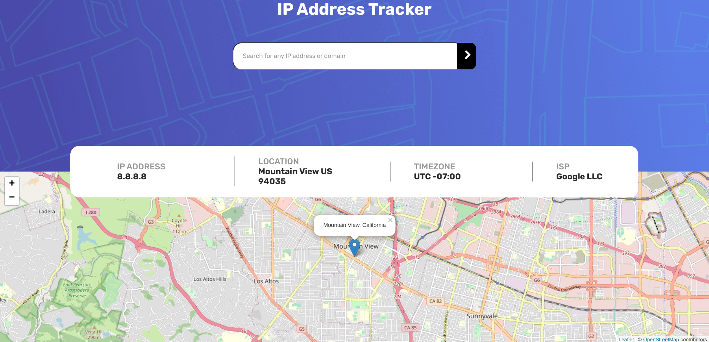

# Frontend Mentor - IP address tracker solution

This is a solution to the [IP address tracker challenge on Frontend Mentor](https://www.frontendmentor.io/challenges/ip-address-tracker-I8-0yYAH0). Frontend Mentor challenges help you improve your coding skills by building realistic projects.

## Table of contents

- [Overview](#overview)
  - [The challenge](#the-challenge)
  - [Screenshot](#screenshot)
- [My process](#my-process)
  - [Built with](#built-with)
  - [What I learned](#what-i-learned)
  - [Continued development](#continued-development)
  - [Useful resources](#useful-resources)

## Overview

### The challenge

Users should be able to:

- View the optimal layout for each page depending on their device's screen size
- See hover states for all interactive elements on the page
- See their own IP address on the map on the initial page load
- Search for any IP addresses or domains and see the key information and location

### Screenshot

## My process

### Built with

- CSS custom properties
- Flexbox
- CSS Grid

### What I learned

- Surprised, I didn't have CORS problems.
- Use click() to get layout correct on load

### Continued development

- Leaflet seems to be dying at present.
- To run, git clone and add API key where YOUR_API_KEY is

### Useful resources

- [Leaflet](https://leafletjs.com/)
- [MDN Docs](https://developer.mozilla.org/en-US/docs/Web/API/Fetch_API/Using_Fetch) - Using Fetch API
- [MDN Docs](https://developer.mozilla.org/en-US/docs/Web/HTTP/CORS#requests_with_credentials) - CORS
- [Stack Overflow](https://stackoverflow.com/questions/391979/how-to-get-clients-ip-address-using-javascript) - Get IP Address
- [Geeks for Geeks](https://www.geeksforgeeks.org/how-to-get-client-ip-address-using-javascript/) - IP Address
- [Stack Overflow](https://stackoverflow.com/questions/43471288/how-to-use-jsonp-on-fetch-axios-cross-site-requests) - JSONP
- [Stack Overflow](https://stackoverflow.com/questions/19186428/refresh-leaflet-map-map-container-is-already-initialized) - Reset Leaflet map
- [Medium](https://medium.com/dailyjs/how-to-create-multi-line-string-with-template-literals-in-javascript-a3a140d0b0f6) - String Template newline
- [Stack Overflow](https://stackoverflow.com/questions/43729577/string-template-new-line-doesnt-show) - String Template newline
